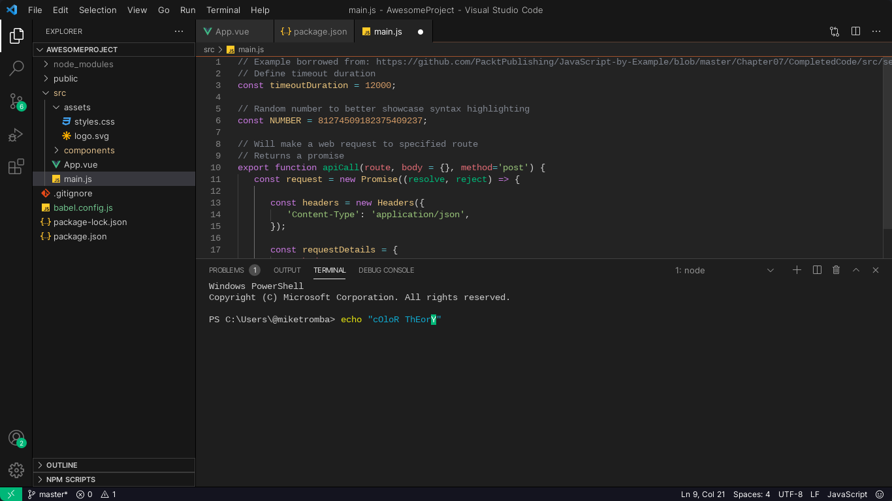
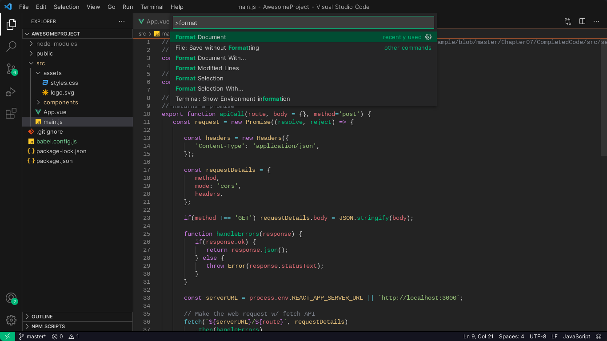

# Verdant Night
"Verdant Night" is a sleek, dark-themed Visual Studio Code (VS Code) interface that brings an essence of deep, rich green hues to your coding environment. The theme is meticulously crafted to offer a visually calming yet vibrant experience, where the dark background is softened by shades of verdant greens for syntax highlighting, providing a contrast that eases eye strain and enhances readability. With carefully chosen accents and an elegant overall design, "Verdant Night" infuses a sense of tranquility into your coding journey while maintaining clarity and focus.

O tema "Verdant Night" é uma interface elegante e escura para o Visual Studio Code (VS Code) que traz uma essência de tons verdes profundos e ricos para o seu ambiente de codificação. O tema é cuidadosamente desenvolvido para oferecer uma experiência visualmente calmante, porém vibrante, onde o fundo escuro é suavizado por tonalidades de verde vívido para realçar a sintaxe, proporcionando um contraste que reduz a fadiga ocular e melhora a legibilidade. Com acentos cuidadosamente selecionados e um design geral elegante, o "Verdant Night" infunde uma sensação de tranquilidade em sua jornada de codificação, mantendo a clareza e o foco.

